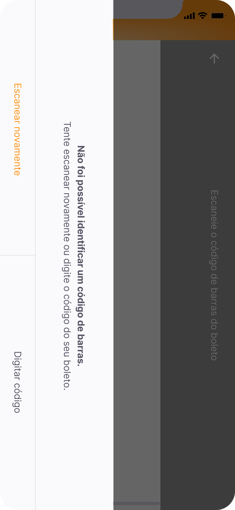

# Payflow

A Flutter app developed over 5 days during Rocketseat's NLW # 6 Together week that aims to help managing the tickets of adult life, organizing them in one place.

## Project Status

This project is just a personal showcase, done with de aim of  register what i have studied, and show my skills. It may receives improvements in the future.

## Features in this project

 - [x] Modular styles and themes
 - [x] Form validation
 - [x] State management with valueNotifier
 - [x] Custom social sign in button
 - [x] Authentication via Google Account with Firebase
 - [x] Signed in user data persistence with SharedPreferences
 - [x] Automatic sign in feature and logout
 - [x] Named routes system with Navigator
 - [x] Google Machine Learning Kit (To read barcodes)
 - [x] Image picker to pick barcode image files stored on device memory

## Project Screen Shots

| Splash                                    | Login                                    | Home                                    |
| ----------------------------------------- | ---------------------------------------- | --------------------------------------- |
|  |  |  |

## 

| Modal                                    | Extract                                    | Register Ticket                                     |
| ---------------------------------------- | ------------------------------------------ | --------------------------------------------------- |
|  |  |  |

## 

| Register Ticket - Try again                                         | Fill the data                                        | Fill the data                                          |
| ------------------------------------------------------------------- | ---------------------------------------------------- | ------------------------------------------------------ |
|  |  |  |

## Installation and Setup Instructions

Clone down this repository. You will need `Flutter` and `Dart` installed globally on your machine.  

Installation:

`flutter pub get install` on the project root.  

To Run the android application:  

`flutter run -d <device or emulator id>`  

To build a android release:

`flutter build apk` the package will be generated on **./build/app/outputs/flutter-apk/app-release.apk**

